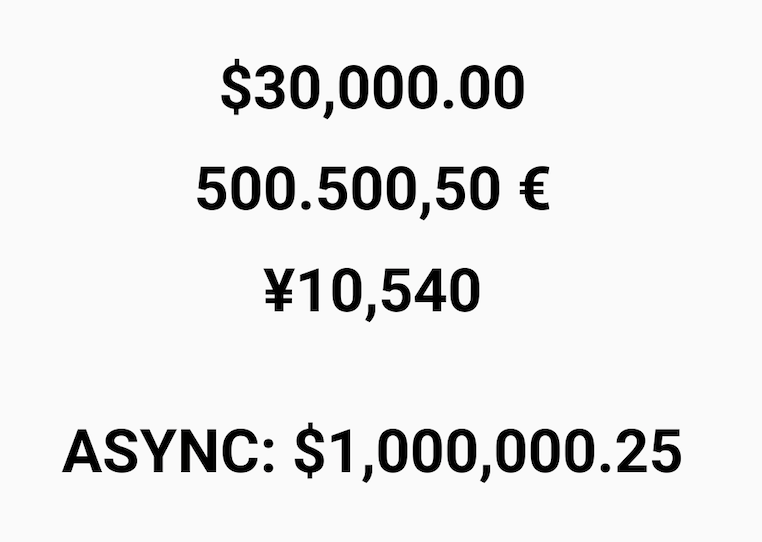

# React Native Android Currency Formatter [](https://twitter.com/intent/tweet?hashtags=javascript&original_referer=https%3A%2F%2Fpublish.twitter.com%2F&ref_src=twsrc%5Etfw&text=Validation%20of%20CSV%20file%20against%20user%20defined%20schema%20(returns%20back%20object%20with%20data%20and%20invalid%20messages)&tw_p=tweetbutton&url=https%3A%2F%2Fwww.npmjs.com%2Fpackage%2Fcsv-file-validator&via=shystrukk) #
[](https://opensource.org/licenses/mit-license.php)
[](https://badge.fury.io/js/react-native-android-currency-formatter)

Native Module for a currency format with specified FORMAT locale.

## Installation

#### npm
```sh
npm install --save react-native-android-currency-formatter
```

#### yarn
```sh
yarn add react-native-android-currency-formatter --save
```

### For iOS use [Internationalization API](https://developer.mozilla.org/en-US/docs/Web/JavaScript/Reference/Global_Objects/Intl/NumberFormat)

## Usage

**Read before use [Synchronous Method](https://reactnative.dev/docs/native-modules-android#synchronous-methods)**

```js
import AndroidCurrencyFormatter from 'react-native-android-currency-formatter';

// Synchronous Method
AndroidCurrencyFormatter.numberFormat(30000, 'USD', 'en', 'US') // $30,000.00

// Asynchronous Method
AndroidCurrencyFormatter
	.numberFormatAsync(1000000.25, 'USD', 'en', 'US')
	.then(data => {
		// $1,000,000.25
	});
```

## API ##
```js
// Synchronous Method
// Returns currency format or 'N/A' if one of the arguments are not correct
numberFormat(amount, currencyCode, language, country)

// Asynchronous Method
// Returns Promise with currency format or 'N/A' if one of the arguments are not correct
numberFormatAsync(amount, currencyCode, language, country)

```
### amount
Type: `Number` <br>
the number which will be converted to currency

### currencyCode
Type: `String` <br>
ISO 4217 currency code. [Some codes](https://stackoverflow.com/questions/3536968/get-all-possible-available-currencies/39259097#39259097)

### language
Type: `String` <br>
An ISO 639 alpha-2 or alpha-3 language code, or a language subtag up to 8 characters in length.

### country
Type: `String` <br>
An ISO 3166 alpha-2 country code or a UN M.49 numeric-3 area code.

Check [example/src/App.tsx](example/src/App.tsx) file if you need more details.



## Contributing

Any contributions you make **are greatly appreciated**.

Please read the [Contributions Guidelines](CONTRIBUTING.md) to learn how to contribute to the repository and the development workflow.


## License

MIT © [Vasyl Stokolosa](https://about.me/shystruk)
